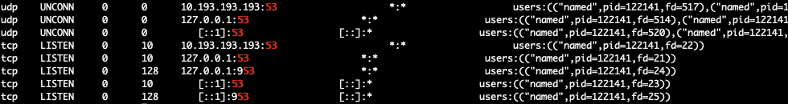

## 安装配置

在CentOS上安装：

```sh
$ yum install bind bind-utils -y
# 查看安装的版本
$ named -v
BIND 9.11.4-P2-RedHat-9.11.4-26.P2.el7_9.16 (Extended Support Version) <id:7107deb>
# 开机自启动
$ systemctl enable named
$ systemctl start named
```

Bind安装完之后, 默认就是一个`仅缓存的`nameserver. 可以作为一个本地的DNS解析器来使用.  
Bind在我们的架构中也正是扮演这样的角色.  
在CentOS上安装完成之后, 默认的配置文件需要修改的不多:

```sh
options {
    # 注释掉下面三行, 会监听本机IP和127.0.0.1两个地址
    # listen-on port 53 { 
    #    127.0.0.1;
    # };

    # 配置允许外部设备DNS查询
	allow-query { any; };
    # 本地解析记录TTL不足10s时自动请求外部DNS服务器, 获取最新的解析记录
    prefetch 10;
...
```

> 仅展示需要修改/添加的内容, 其他的保持默认即可.

修改完成之后重启生效:

```sh
systemctl restart named
```

## 检查服务状态

1. 先检查系统服务是否正常

```sh
systemctl status named
```
如果看到`active (running)`说明服务运行正常.

2. 检查服务日志

可以通过检查named服务的日志来判断服务是否存在问题.

```sh
journalctl -u named -f
```

重点关注error相关日志. 如果遇到`network unreachable resolving 'registry-1.docker.io/AAAA/IN': 2a01:8840:9f::17#53`类型日志, 往往是因为国内防火墙原因, 可以忽略.

3. 检查监听的端口

检查端口有没有正常监听, 也是判断服务是否运行正常的一个重要因素.

```sh
ss -nlp | grep 53
```

观察udp和tcp两个协议的53端口是否监听, 以10.193.193.193这台服务器为例, 要保证下面的这些监听都要有.



> 953端口是BIND服务的rndc(Remote Name Daemon Control)默认端口

## 测试服务

我们可以使用nslookup和dig两个工具快速测试dns服务是否好用.  

我们以测试`10.193.193.193`为例:

- nsloopup

```sh
$ nslookup www.example.com 10.193.193.193
Server:		10.193.193.193
Address:	10.193.193.193#53

Non-authoritative answer:
Name:	www.example.com
Address: 10.193.41.30
```

- dig

这个命令给的信息能更丰富一些.

```sh
$ dig www.example.com @10.193.193.193

; <<>> DiG 9.11.4-P2-RedHat-9.11.4-26.P2.el7_9.16 <<>> www.example.com @10.193.193.193
;; global options: +cmd
;; Got answer:
;; ->>HEADER<<- opcode: QUERY, status: NOERROR, id: 2889
;; flags: qr rd ra; QUERY: 1, ANSWER: 1, AUTHORITY: 2, ADDITIONAL: 23

;; OPT PSEUDOSECTION:
; EDNS: version: 0, flags:; udp: 4096
;; QUESTION SECTION:
;www.example.com.			IN	A

;; ANSWER SECTION:
www.example.com.		554	IN	A	10.193.41.30

;; AUTHORITY SECTION:
example.com.		83692	IN	NS	vip3.alidns.com.
example.com.		83692	IN	NS	vip4.alidns.com.

;; ADDITIONAL SECTION:
vip3.alidns.com.	83692	IN	A	140.205.1.5
vip3.alidns.com.	83692	IN	A	170.33.32.210
vip3.alidns.com.	83692	IN	A	170.33.40.136
vip3.alidns.com.	83692	IN	A	170.33.73.26
vip3.alidns.com.	83692	IN	A	170.33.80.10
vip3.alidns.com.	83692	IN	A	8.129.152.245
vip3.alidns.com.	83692	IN	A	8.212.93.3
vip3.alidns.com.	83692	IN	A	39.103.26.212
vip3.alidns.com.	83692	IN	A	47.116.84.178
vip3.alidns.com.	83692	IN	A	121.40.6.163
vip4.alidns.com.	83692	IN	A	8.212.93.4
vip4.alidns.com.	83692	IN	A	39.103.26.213
vip4.alidns.com.	83692	IN	A	47.116.84.179
vip4.alidns.com.	83692	IN	A	121.40.6.164
vip4.alidns.com.	83692	IN	A	140.205.1.6
vip4.alidns.com.	83692	IN	A	170.33.32.211
vip4.alidns.com.	83692	IN	A	170.33.40.137
vip4.alidns.com.	83692	IN	A	170.33.73.27
vip4.alidns.com.	83692	IN	A	170.33.80.11
vip4.alidns.com.	83692	IN	A	8.129.152.246
vip3.alidns.com.	83692	IN	AAAA	2408:4009:500::3
vip4.alidns.com.	83692	IN	AAAA	2408:4009:500::4

;; Query time: 0 msec
;; SERVER: 10.193.193.193#53(10.193.193.193)
;; WHEN: Mon Feb 10 15:29:32 CST 2025
;; MSG SIZE  rcvd: 478
```

大家关注下`ANSWER SECTION:`部分的这个`554`, 这个数字是距离该条记录失效的时间, 单位是秒. 解析记录中配置的TTL会影响该值的初始值, 随着时间它会逐渐减小.


## 监控和告警

可以使用`blackbox-exporter`的dns能力做监控.