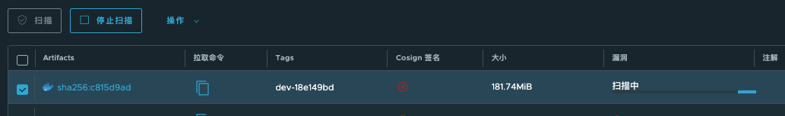
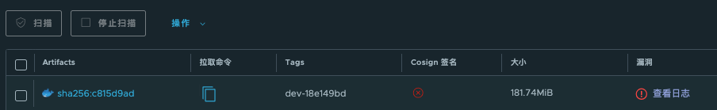

## 问题描述




点击查看日志, 错误日志如下：

```
2025-01-08T01:53:23Z [INFO] [/pkg/scan/job.go:167]: Report mime types: [application/vnd.security.vulnerability.report; version=1.1]
2025-01-08T01:53:23Z [INFO] [/pkg/scan/job.go:224]: Get report for mime type: application/vnd.security.vulnerability.report; version=1.1
2025-01-08T01:53:25Z [INFO] [/pkg/scan/job.go:245]: Report with mime type application/vnd.security.vulnerability.report; version=1.1 is not ready yet, retry after 5 seconds
2025-01-08T01:53:30Z [ERROR] [/pkg/scan/job.go:294]: check scan report with mime type application/vnd.security.vulnerability.report; version=1.1: running trivy wrapper: running trivy: exit status 2: 2025-01-08T01:53:26.342Z	[INFO]	Vulnerability scanning is enabled
panic: invalid page type: 39: 10

goroutine 1 [running]:
go.etcd.io/bbolt.(*Cursor).search(0xc0059f8520, {0xc001ecfdb0, 0x47, 0x50}, 0x0?)
	/home/runner/go/pkg/mod/go.etcd.io/bbolt@v1.3.6/cursor.go:250 +0x299
go.etcd.io/bbolt.(*Cursor).searchPage(0xc0059f8520, {0xc001ecfdb0, 0x47, 0x50}, 0x6c3f5e0?)
	/home/runner/go/pkg/mod/go.etcd.io/bbolt@v1.3.6/cursor.go:308 +0x166
go.etcd.io/bbolt.(*Cursor).search(0xc0059f8520, {0xc001ecfdb0, 0x47, 0x50}, 0xc0059f84d8?)
	/home/runner/go/pkg/mod/go.etcd.io/bbolt@v1.3.6/cursor.go:265 +0x1db
go.etcd.io/bbolt.(*Cursor).seek(0xc0059f8520, {0xc001ecfdb0?, 0x50?, 0xc0059f8540?})
	/home/runner/go/pkg/mod/go.etcd.io/bbolt@v1.3.6/cursor.go:159 +0x48
go.etcd.io/bbolt.(*Bucket).Get(0xc0017caac0, {0xc001ecfdb0, 0x47, 0x50})
	/home/runner/go/pkg/mod/go.etcd.io/bbolt@v1.3.6/bucket.go:262 +0x85
github.com/aquasecurity/trivy/pkg/fanal/cache.FSCache.getBlob({_, {_, _}}, _, {_, _})
	/home/runner/work/trivy/trivy/pkg/fanal/cache/fs.go:70 +0x78
github.com/aquasecurity/trivy/pkg/fanal/cache.FSCache.MissingBlobs.func1(0xc001ecee60?)
	/home/runner/work/trivy/trivy/pkg/fanal/cache/fs.go:164 +0x153
go.etcd.io/bbolt.(*DB).View(0x41429f?, 0xc0059f8ae8)
	/home/runner/go/pkg/mod/go.etcd.io/bbolt@v1.3.6/db.go:772 +0x82
github.com/aquasecurity/trivy/pkg/fanal/cache.FSCache.MissingBlobs({0xc005b978c0?, {0xc005874320?, 0xc001bea7a0?}}, {0xc001ecf5e0, 0x47}, {0xc0026df700?, 0x0?, 0x0?})
	/home/runner/work/trivy/trivy/pkg/fanal/cache/fs.go:161 +0xfe
github.com/aquasecurity/trivy/pkg/fanal/artifact/image.Artifact.Inspect({{0x82dd970, 0xc001747880}, {0x7fb90c068258, 0xc001a23be0}, {{{0x0, 0x0, 0x0}, {0xc001747dc0, 0x3, 0x4}}}, ...}, ...)
	/home/runner/work/trivy/trivy/pkg/fanal/artifact/image/image.go:116 +0x6b1
github.com/aquasecurity/trivy/pkg/scanner.Scanner.ScanArtifact({{_, _}, {_, _}}, {_, _}, {{0xc00164eca0, 0x2, 0x2}, {0xc0019e7d50, ...}, ...})
	/home/runner/work/trivy/trivy/pkg/scanner/scan.go:125 +0x103
github.com/aquasecurity/trivy/pkg/commands/artifact.scan({_, _}, {{{0x71a5e83, 0xa}, 0x0, 0x0, 0x0, 0x0, 0x45d964b800, {0x7ffcbf77b887, ...}, ...}, ...}, ...)
	/home/runner/work/trivy/trivy/pkg/commands/artifact/run.go:542 +0x36b
github.com/aquasecurity/trivy/pkg/commands/artifact.(*runner).scanArtifact(_, {_, _}, {{{0x71a5e83, 0xa}, 0x0, 0x0, 0x0, 0x0, 0x45d964b800, ...}, ...}, ...)
	/home/runner/work/trivy/trivy/pkg/commands/artifact/run.go:228 +0xdd
github.com/aquasecurity/trivy/pkg/commands/artifact.(*runner).ScanImage(_, {_, _}, {{{0x71a5e83, 0xa}, 0x0, 0x0, 0x0, 0x0, 0x45d964b800, ...}, ...})
	/home/runner/work/trivy/trivy/pkg/commands/artifact/run.go:174 +0x165
github.com/aquasecurity/trivy/pkg/commands/artifact.Run({_, _}, {{{0x71a5e83, 0xa}, 0x0, 0x0, 0x0, 0x0, 0x45d964b800, {0x7ffcbf77b887, ...}, ...}, ...}, ...)
	/home/runner/work/trivy/trivy/pkg/commands/artifact/run.go:369 +0xaa4
github.com/aquasecurity/trivy/pkg/commands.NewImageCommand.func2(0xc003f2ca00, {0xc0026de600?, 0x1?, 0x10?})
	/home/runner/work/trivy/trivy/pkg/commands/app.go:269 +0x185
github.com/spf13/cobra.(*Command).execute(0xc003f2ca00, {0xc0026de400, 0x10, 0x10})
	/home/runner/go/pkg/mod/github.com/spf13/cobra@v1.5.0/command.go:872 +0x694
github.com/spf13/cobra.(*Command).ExecuteC(0xc003f2c780)
	/home/runner/go/pkg/mod/github.com/spf13/cobra@v1.5.0/command.go:990 +0x3bd
github.com/spf13/cobra.(*Command).Execute(...)
	/home/runner/go/pkg/mod/github.com/spf13/cobra@v1.5.0/command.go:918
main.run()
	/home/runner/work/trivy/trivy/cmd/trivy/main.go:37 +0x177
main.main()
	/home/runner/work/trivy/trivy/cmd/trivy/main.go:19 +0x19
: general response handler: unexpected status code: 500, expected: 200
```

看日志中的错误堆栈, 我发现在读取trivy数据库文件的时候报错了, 所以我的解决办法是, 删掉原来的数据库文件, 让trivy重建一个.

## 解决办法

我把Harbor的数据目录放在了`/data/harbor_data`, 你可根据自己的实际情况替换.

```
rm -f /data/harbor_data/trivy-adapter/trivy/fanal/fanal.db
```

此时再扫描就可以了!  
造成db文件损坏的原因多样, 比如服务器异常关机等.