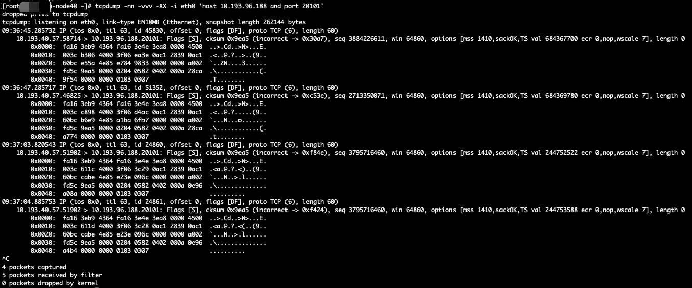
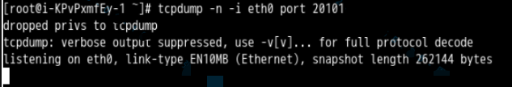
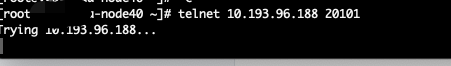

## 问题描述

用户反应, 在kubernetes中部署的pod去访问外部的redis时, 速度很慢.  
redis地址: `10.193.96.73:20100,10.193.96.73:20101,10.193.96.188:20100,10.193.96.188:20101,10.193.96.189:20100,10.193.96.189:20101`

已知:
- pod ip: 10.194.43.122
- pod所在机器ip: 10.193.40.57

## tcpdump抓包

我们选择一个redis端点(10.193.96.188:20101)抓包, 登录pod所在node(10.193.40.57)执行抓包:

`tcpdump -n -i eth0 'host 10.193.96.188 and port 20101'`

在redis所在服务器上抓包:

我们分析一下结果:

包含多个 SYN 包`[S]`（TCP 握手的第一个步骤, 同一主机`10.193.40.57`多次尝试与目标主机建立连接：
- 首次尝试：09:36:45.205732
- 再次尝试：09:36:47.285717
- 第三次尝试：09:37:03.820543
- 第四次尝试：09:37:04.885753

表明目标主机可能没有响应（例如服务未运行、网络问题或防火墙阻止）。

于是我想在目标服务器上, 也就是redis主机上使用同样的端口抓包.

`tcpdump -n -i eth0 'host 10.193.40.57 and port 20101'`

发现并没有任何包. 怀疑是不是端口根本不通啊.

## telnet测试端口

在pod所在node上测试redis服务器上20101端口是不是不通.

`telnet 10.193.96.188 20101`

还真是, 端口不通.

于是去排查虚拟机所在安全组, 发现安全组没有开放该端口. **安全组添加该端口**之后发现问题解决.

## 总结

因为redis暴露了很多端点, 有三台服务器, 每一台服务器暴露了两个端口20100和20101. 所以pod服务在连接redis时, 遇到20101端口失败之后, 尝试重传, 也就是`TCP Retransmission`. 重传也不行, 然后切换使用了20100端口, 然后完成redis读写. 这样的现象就是, redis没有完全无法使用, 只是读写速度慢.  
因为有使用20101端口重试的过程, 和切换端口20100的过程, 所以这个过程很慢. 这就解释了为什么用户反映连接redis速度慢.

其实很简单的一个问题, 遇到这样的问题, 完全可以通过telnet测试一下端口就能解决的. 抓了半天包, 浪费时间. 可见解决问题的思路非常重要. 先了解整个通讯的流程和原理, 要逐层分析, 渐渐的深入才可以.