我们都知道公有云提供的智能DNS解析, 仅能精确到大区域, 比如华北区域, 省份. 或者精确到线路, 比如联通或者移动. 并无法精确到城市、地区、或者是某一个大楼. 这种精确的就近智能解析是我要解决的问题.

大部分情况, 我们的域名和解析在阿里云管理. 

这篇文章的方法需要升级该云解析至企业旗舰版, 就可以获得自定义线路的功能.

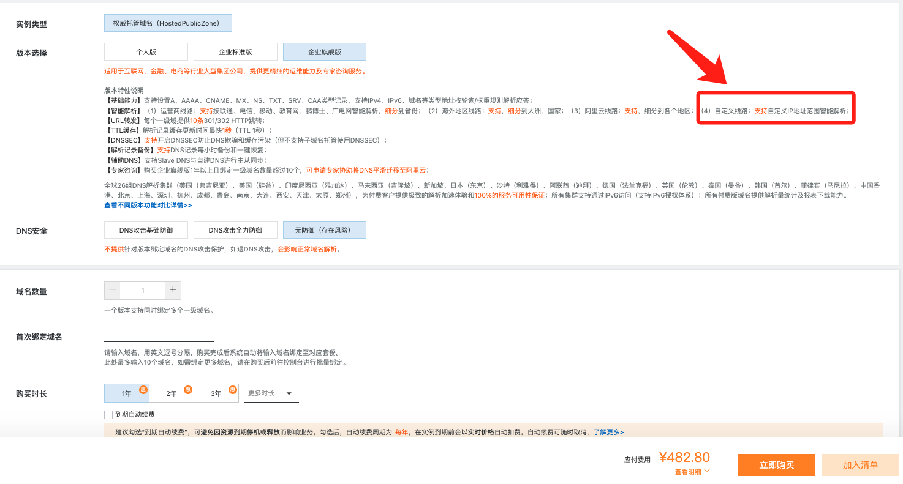

每年的费用不到500元.

在本地数据中心通过部署Bind9访问该解析服务。

特点：
- 就近解析, 可以精细化到网段
- 有友好的用户界面
- 有阿里云运维保障
- 成本较低, 约500元/年。

## 整体架构

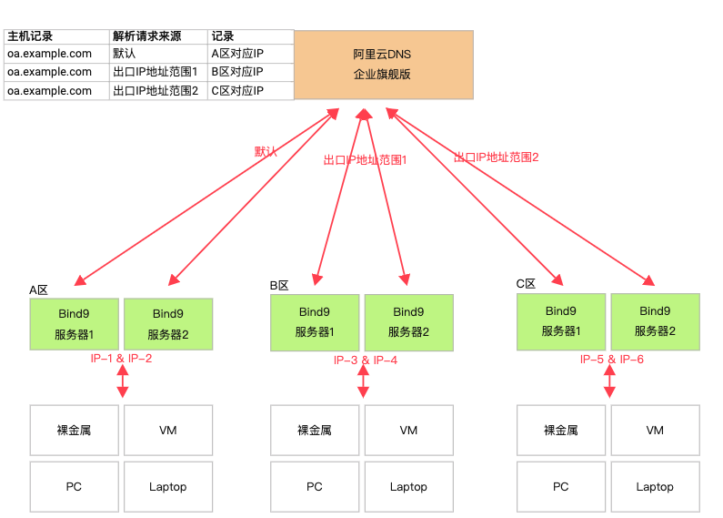

借助云解析的自定义线路的能力实现根据给定网段/IP地址来判断解析的线路，返回特定记录值。  
每个数据中心部署2台Bind9服务器，仅作为本地的DNS缓存使用，设计2台服务器是为了实现高可用。  
在云解析服务处通过配置自定义线路的方式，同一个域名(例如oa.example.com)就可以根据不同数据中心的代理服务器的出口IP地址来判断解析的线路返回该区域/数据中心的地址。  

## 实现

实现该架构需要解决：

- 1 在数据中心内部部署Bind9*2
- 2 确定各数据中心Bind9服务的出口IP地址
- 3 购买阿里云云解析DNS服务权威解析企业旗舰版

### BIND9安装配置

在CentOS上安装, 服务器IP地址为: 10.193.41.22：

```sh
$ yum install bind bind-utils -y
# 查看安装的版本
$ named -v
BIND 9.11.4-P2-RedHat-9.11.4-26.P2.el7_9.16 (Extended Support Version) <id:7107deb>
# 开机自启动
$ systemctl enable named
$ systemctl start named
```

默认安装后就是一个仅缓存使用Nameserver，需要配置的内容不多，修改主配置文件：

```sh
$ vi /etc/named.conf
# 仅展示需要修改的内容

# 注释下面三行增加监听范围
# listen-on port 53 { 
#     127.0.0.1;
# };

allow-query  { any; }; # 放开客户端查询请求
prefetch  10; # 缓存还差10s就过期时会再去权威解析请求记录
```

### 获取出口IP地址

多执行几次命令<`dig @<ns-ip> +short TXT whoami.ds.akahelp.net`获取出口IP地址。

```
$ dig @10.193.41.22 +short TXT whoami.ds.akahelp.net
# ns是本地机器使用的Bind9出口IP地址
"ns" "113.200.54.74"
```

注意：**自定义线路只支持IPv4地址，不支持IPv6地址。**

拿到出口IP之后，使用该IP地址配置阿里云云解析DNS服务的自定义线路服务。之后就是开始测试效果，观察能否根据这个出口IP地址判断解析线路。

## 测试

测试域名：`test.llaoj.cn` <个人采购>  

### 1 配置阿里云解析

购买企业旗舰版之后, 配置:

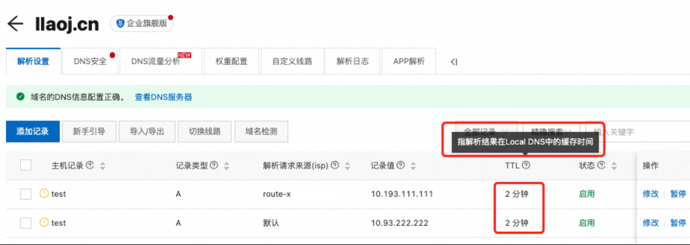

图中需要注意：

- TTL是指解析结果在Bind9中的缓存时间，时间可配置1s-1d. 配置2分钟，也就是说解析记录会在Bind9中缓存2分钟时间。
- 配置2条线路测试
  - 在B区内网访问走线路`route-x`返回记录10.193.111.111
  - 在A区内网访问走默认线路返回记录10.193.222.222

自定义线路的详细配置如下：

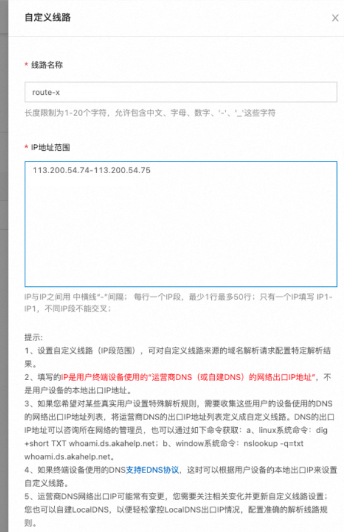

### 2 完成Bind9服务器的部署

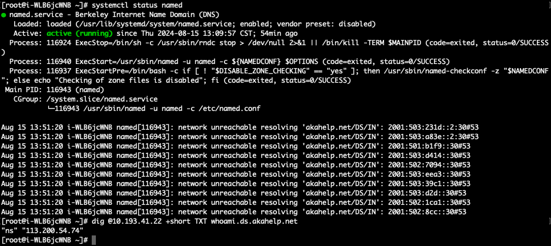

### 3 测试能否正确根据线路解析

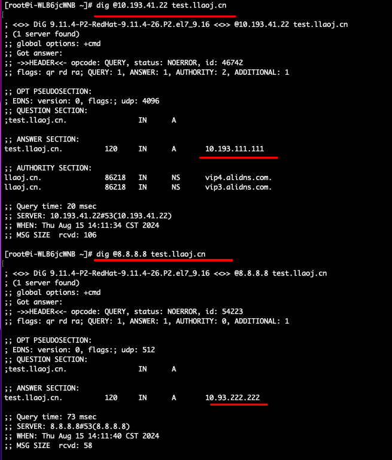

可以根据解析请求来源来区分线路，符合预期。

### 4 测试缓存时间

主要是保证当外网不可用时，本地Bind9在一定时间内还能返回解析记录。从而保证本地服务的稳定。

```sh
rm -f /tmp/dig.log && while true; do sleep 2  &&  dig  @10.193.41.22 test.llaoj.cn >>/tmp/dig.log; done
# 再开个Terminal窗口
# 过一会执行
echo ">>>>>>>>>>>panic $(date)<<<<<<<<<<<<<<" >>/tmp/dig.log && iptables -t filter -A OUTPUT --proto udp --dport 53 -j DROP
# 等待TTL后执行 观察dig开始失败的时间
echo ">>>>>>>>>>>recover $(date)<<<<<<<<<<<<<<" >>/tmp/dig.log && iptables -t filter -D OUTPUT --proto udp --dport 53 -j DROP
```

故障开始：

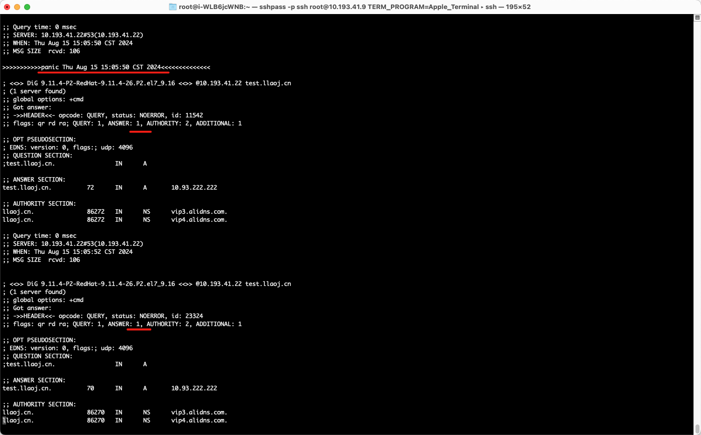

72s后开始失效：

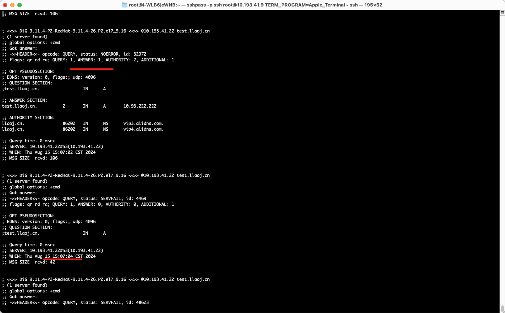

比较从故障开始到无法解析（缓存失效）的时间约2min，符合预期。

为了测试更准确/全面，我们开始测试10min情况。


故障开始，依旧可以解析：

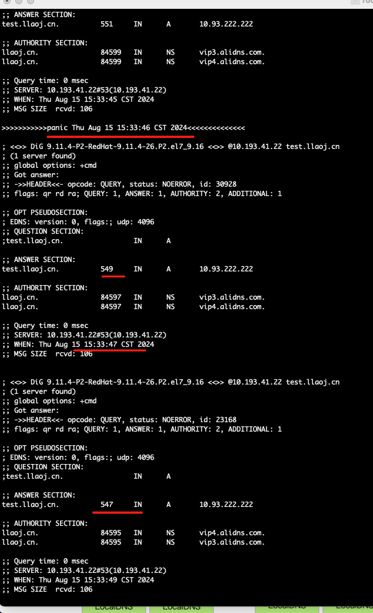

约10分钟（549s）后，开始缓存失效：

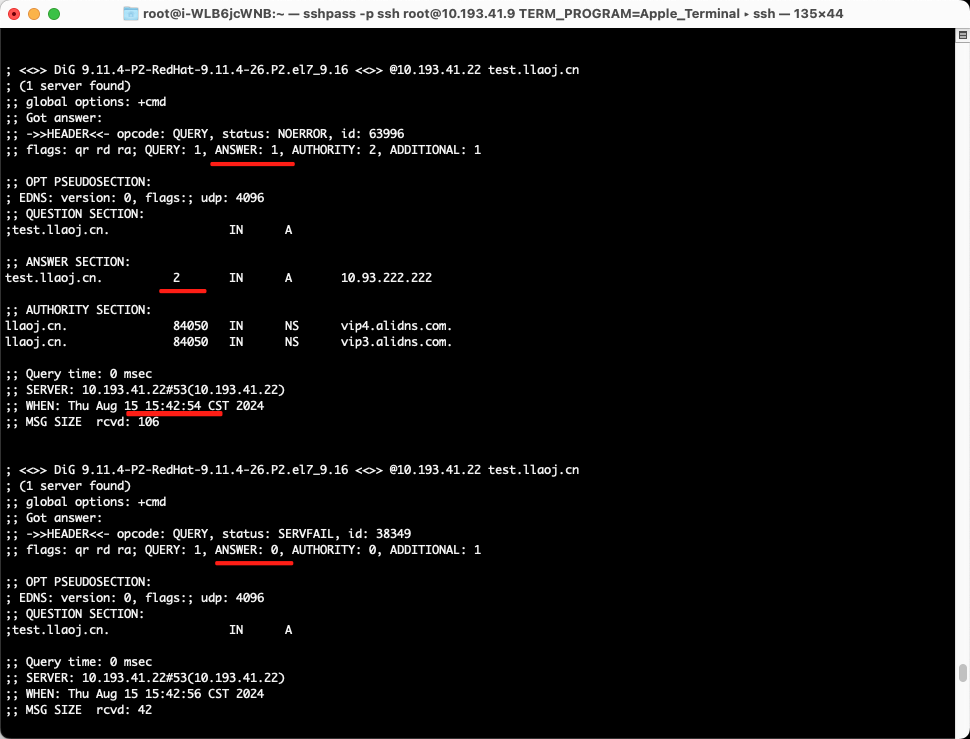

故障恢复后，解析恢复：

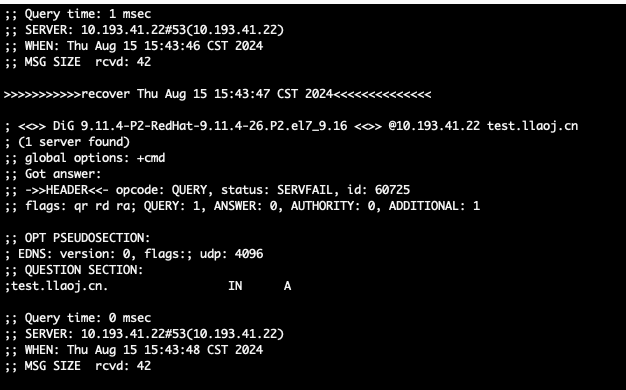
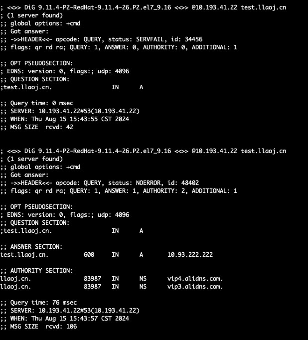

符合预期。