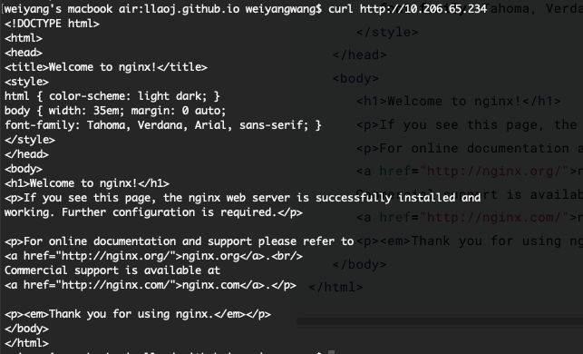
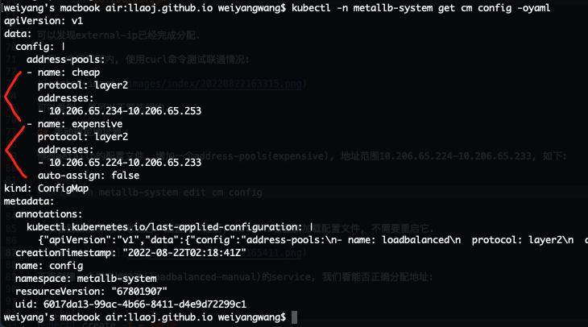
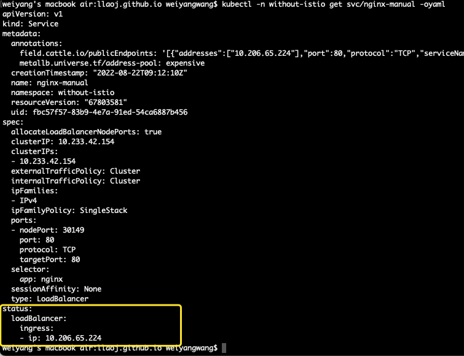
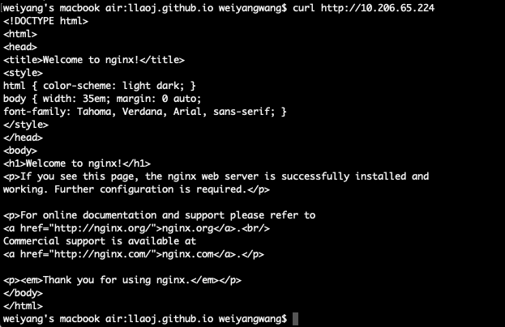

[MetalLB概念安装配置和使用请查看](/posts/2205/metalb/)

## 测试组件的版本情况

- kubernetes: v1.22.8
- metellb: v0.10.3
- nginx: latest

## 创建测试应用

创建一个nginx服务和service资源:

```shell
kubectl -n without-istio create deploy nginx --image=nginx
```

## 测试分配IP

创建loadbalancer类型的service:

```shell
kubectl -n without-istio create service loadbalancer nginx --tcp=80:80
```

查看该service详细配置:

```yaml
apiVersion: v1
kind: Service
metadata:
  labels:
    app: nginx
  namespace: without-istio
  name: nginx
...
spec:
  allocateLoadBalancerNodePorts: true
  clusterIP: 10.233.15.89
  clusterIPs:
  - 10.233.15.89
  externalTrafficPolicy: Cluster
  internalTrafficPolicy: Cluster
  ipFamilies:
  - IPv4
  ipFamilyPolicy: SingleStack
  ports:
  - name: 80-80
    nodePort: 30662
    port: 80
    protocol: TCP
    targetPort: 80
  selector:
    app: nginx
  sessionAffinity: None
  type: LoadBalancer
status:
  loadBalancer:
    ingress:
    - ip: 10.206.65.234
```

可以发现external-ip已经完成分配.

在同一个局域网内, 使用curl命令测试联通情况:



可以看到, 是可以正常访问的.

## 手动指定地址池

默认, metallb会从所有的可用地址池中分配IP, 除非我们关闭某一个地址池的自动分配`auto-assign: false`.

metallb v0.12之前都是用configmap进行配置, 而不是用CRD. 这里是[配置相关文档](https://github.com/metallb/metallb/blob/v0.10.3/website/content/configuration/_index.md).

下面我们让集群中有两个地址池, 其中一个关闭自动分配. 修改metallb的配置文件, 增加一个address-pools(expensive), 地址范围10.206.65.224-10.206.65.233, 如下:

```shell
kubectl -n metallb-system edit cm config
```

可以看到目前有两个地址池, 同时配置`auto-assign: false`来关闭对expensive地址池的自动分配. 配置完毕之后, metallb会重新加载配置文件, 不需要重启它.



下面创建一个指定地址池(loadbalanced-manual)的service, 我们看能否正确分配地址:


```shell
kubectl create -f - <<EOF
apiVersion: v1
kind: Service
metadata:
  name: nginx-manual
  namespace: without-istio
  annotations:
    metallb.universe.tf/address-pool: expensive
spec:
  ports:
  - port: 80
    targetPort: 80
  selector:
    app: nginx
  type: LoadBalancer
EOF
```

继续查看刚创建的service, 发现IP地址已经成功分配, 而且地址范围也符合预期:



经测试访问正常:

