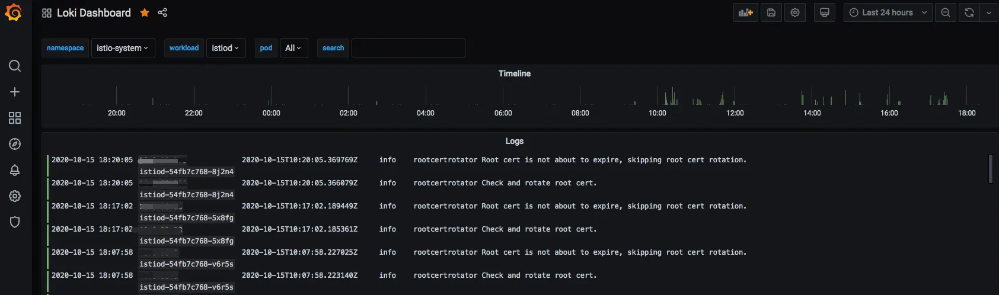
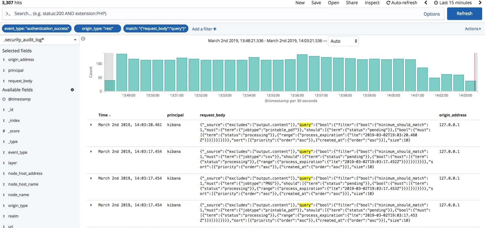
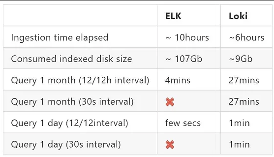
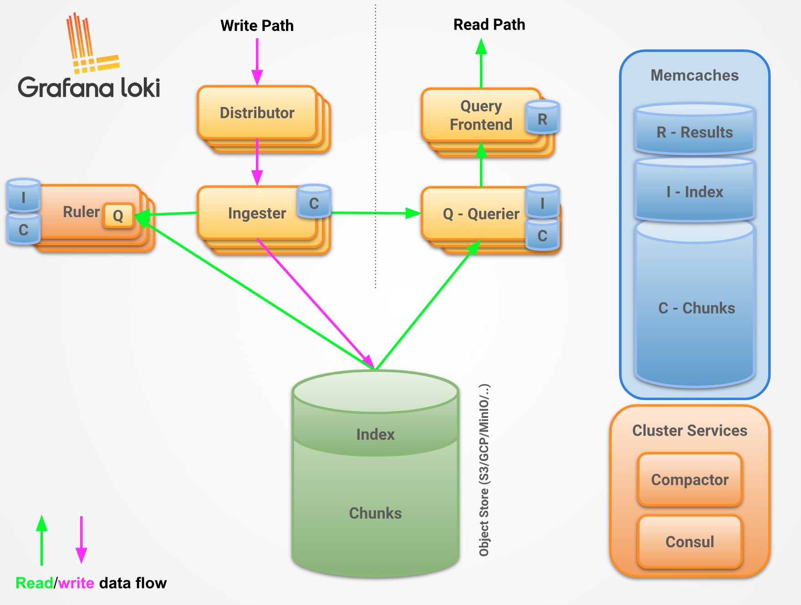

# Kubernetes相关日志方案

## 目前的方案

目前的方案简单概括来说是: fluentd(daemonset)+es+kibana. 使用fluentd在集群每个节点运行一个fluentd实例采集日志通过调用k8s接口为每个日志添加kubernetes和container相关的标签, 然后直接发送到es存储.

### 痛点

- es集群的维护成本较高, 比如索引的管理和优化, 集群规模的维护等. 需要技术和经验的加持, 故障处理效率不高.
- es日志需要多副本, 并对整个文档进行索引, 占用资源较多.
- fluentd直接推送到es, 中间少了流量缓冲.(fluentd自带缓冲区,该问题可有所缓解).
- fluentd配置复杂

下面的方案会针对当前的方案提出, 分析与当前方案的优劣比较:

## 1 升级现有方案

- 节点代理升级为FluentBit, flb使用golang开发速度比flentd快, 而且资源占用也较低. 也已经从cncf毕业.
- 增加Kafka流量削峰, 虽然flentbit有缓冲机制, 再增加kafka能进一步增加故障/流量高峰缓冲的能力.
  - 增加kafka之后, 推送到es是有消费者来完成的. 日志的流计算、解析、索引的控制不再依赖fluentbit, 相对自由.
- 优化索引机制, 通过配置可以实现:
  - 按照集群每日一个索引(当前策略)
  - 按照租户每日一个索引

## 2 promtail+loki+grafana

### loki vs es

二者最大的不同是索引, loki被设计成使用最小的索引, 但是es是全文索引, 而且每个字段都有数据结构. 所以, loki有好的性能和资源消耗. 但是富文本搜索的能力不及es.

loki存储可以使用的后端存储有很多, 比如本地文件系统或者使用对象存储(s3兼容), 这也是它的优势, 更适合云环境, 这将进一步降低成本.

### 查询语言

kibana自己有个KQL语言或者也可以使用lucene查询语法, 这个使用的时间比较长了, 网上有很多查询例子. 

loki使用logQL查询日志, 主要包含两个部分, 一个是标签选择器, 一个是日志过滤表达式. 查询性能与标签选择有关系, 标签选择的日志量大查询时间就长. 语法上相比上面两个相对简单. 这里是一个例子:

`{container="query-frontend",namespace="loki-dev"} |= "metrics.go" | logfmt | duration > 10s and throughput_mb < 500`

`{}`中的是标签选择器, 选择loki-dev/query-frontend容器中的日志. 后面部分是过滤器, 过滤包含metrics.go关键词的日志, 并将其按照logfmt格式化, 并按照格式化之后的日志条件筛选.

### 节点代理 promtail vs fluentd

promtail与fluentd一样也是在节点上收集日志, 主要三个步骤: 发现目标文件、给日志附加标签、把日志推送到loki. fluentd/fluentbit相较promtail功能丰富一些. promtail和fluentbit使用golang开发, fluentd使用ruby开发, 相较fluentd资源占用较小性能更高. 

同时可见fluentbit可以作为fluentd的替代.

### 用户交互 grafna vs kibana

因为loki也是grafana labs公司的产品, grafana支持日志的查询, 相比kibana都差不多, 毕竟grafana之前只是kibana的一个分支.

grafana log

kibana log

### 特点和优势

loki仅会索引标签和元数据, 日志数据被压缩为chuck存储(类似s3). 因为es支持全文索引, es会索引整个文档, 日志以json形式存储在磁盘中, 比loki占用更多的存储.    

### 缺点

- 因为只是对元数据和标签索引, loki虽然占用资源比es少, 但是查询能力不及es.

## 总结

loki的出现比较契合k8s pod日志存储查询的使用场景. 占用更少的存储空间, 虽然查询能力比es差, 但能满足pod日志查询的使用场景. es虽然在维护和资源消耗上处于劣势, 但是它对查询能力、查询速度、统计、分析上的支持还是要比loki好的.

这是其他人对两个方案测试的结果, 可以参考:

引用自: https://crashlaker.medium.com/which-logging-solution-4b96ad3e8d21

可以看到在摄取数据、磁盘占用上loki有一定优势, 但是在查询/分析上(里面涉及日志某系字段的计算, 比如nginx状态码、延迟)loki却逊色不少.

## 参考

写本方案阅读了一些资料文献:

- Loki vs Elasticsearch - Which tool to choose for Log Analytics?: https://signoz.io/blog/loki-vs-elasticsearch/
- Comparing Logging Solutions: https://crashlaker.medium.com/which-logging-solution-4b96ad3e8d21
- 日志分析下ES/ClickHouse/Loki比较与思考: https://zhuanlan.zhihu.com/p/396211457
- Loki Filesystem Proc/Cons: https://grafana.com/docs/loki/latest/operations/storage/filesystem/

## W3: 进一步测试并细化Loki方案

本文主要是从
- 维护性
- 高可用
- 使用体验
- 性能上
- 磁盘存储
几个方面展开. 并没有关注聚合计算、复杂的查询等方面.

### 高可用架构

#### Monolithic mode

Monolithic mode is useful for getting started quickly to experiment with Loki, as well as for small read/write volumes of up to approximately 100GB per day.
