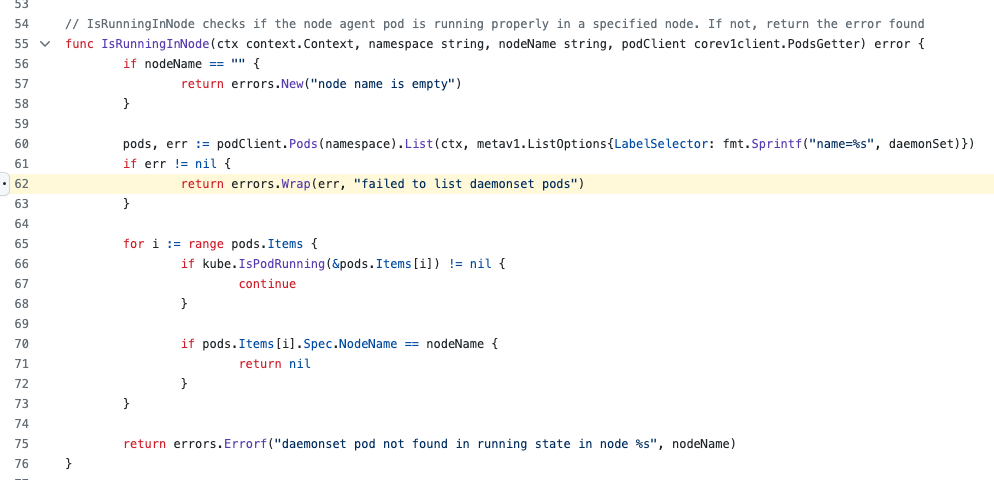
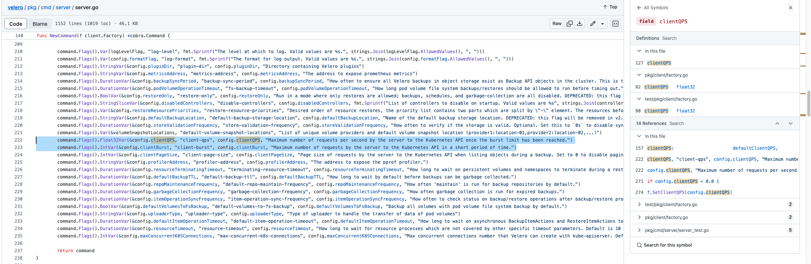

使用VeleroFSB备份集群的时候, 遇到了一些错误, 导致整个备份任务没有成功, 状态: `PartiallyFailed`.

以下是报错日志: 

```log
$ velero backup describe backup-20230903090401
Name:         backup-20230903090401
Namespace:    velero
Labels:       velero.io/schedule-name=backup
              velero.io/storage-location=default
Annotations:  velero.io/source-cluster-k8s-gitversion=v1.22.17
              velero.io/source-cluster-k8s-major-version=1
              velero.io/source-cluster-k8s-minor-version=22

Phase:  PartiallyFailed (run `velero backup logs backup-20230903090401` for more information)


Errors:
  Velero:    name: /resource-nginx-8559c56b49-7w5w8 error: /timed out waiting for all PodVolumeBackups to complete
             name: /yjwz-server-55bbc5b5f4-rz9wz error: /failed to list daemonset pods: client rate limiter Wait returned an error: context deadline exceeded
             name: /yjwz-web-67d9f496c9-9v45p error: /failed to list daemonset pods: client rate limiter Wait returned an error: context deadline exceeded
             name: /fs-erp-dev-5b549f6788-trtr7 error: /failed to list daemonset pods: client rate limiter Wait returned an error: context deadline exceeded
             name: /fs-erp-test-6c9c64b495-6twpr error: /failed to list daemonset pods: client rate limiter Wait returned an error: context deadline exceeded
             ...
```

通过google并没有找到答案, 好像大家没有遇到这个问题, 翻遍官方文档也没有. 于是我拿着报错日志, 去搜索了源代码, 找到了该报错对应的逻辑. 



可以看到, 这是在对node-agent进行健康检查, 通过kubernetes接口查找daemonset管理的pods列表的方式来对node-agent进行健康检查. http客户端报超过请求次数限制. 那么应该会有请求次数限制的相关定义.

通过定位`podClient`的来源, 找到了关于速率的定义参数: 



Github现在做的越来越好了, 检索分析代码也很方便. 代码中定义的--client-qps默认值为20.0, --client-burst默认值为30, 将其提高配置如下:

```yaml
      containers:
      - args:
        - server
        - --features=
        - --default-volumes-to-fs-backup=true
        - --uploader-type=restic
+       - --client-qps=2000.0
+       - --client-burst=3000
        command:
        - /velero
```

再执行一遍备份试试:

```sh
velero backup create backup-cluster-20230904
```